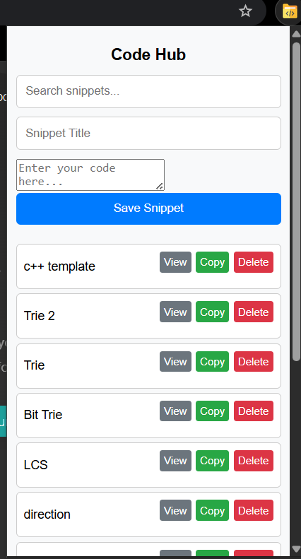
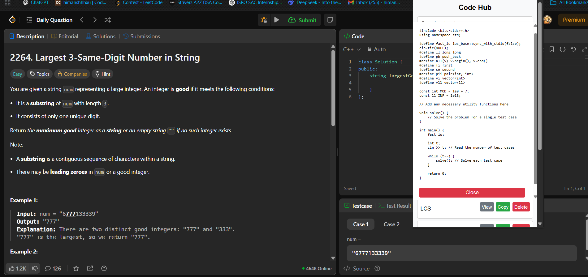

# 🚀 CodeHub: Your Personal Code Snippet Saver

**CodeHub** is a lightweight Chrome extension built for **competitive programmers** and **developers**.  
It allows you to **save, search, and manage your code snippets** directly in your browser — no more switching tabs or wasting time searching for boilerplate code during contest

## 💡 Why CodeHub?
During competitive programming contests, switching between tabs to find your templates can waste precious seconds.  
**CodeHub** solves this by keeping your most-used code just **one click away** in your browser toolbar.

---

## ✨ Features
- **Save Snippets** – Add new code snippets with a custom title.  
- **Search Functionality** – Instantly filter snippets with real-time search.  
- **Quick Actions** – View, copy, or delete snippets directly from the popup.  
- **Persistent Storage** – Snippets are stored in your browser’s local storage and remain available offline.

---

## 🛠 How to Use

- **Save a Snippet** – Click the CodeHub icon → Enter a title and paste your code → Click **"Save Snippet"**.  
- **Search Snippets** – Use the search bar to quickly find snippets by title.  
- **Manage Snippets**:
  - **View** – Displays the full code in a pop-up.  
  - **Copy** – Instantly copies the code to your clipboard.  
  - **Delete** – Permanently removes the snippet.  

---

## 📷 Screenshots

## 💻 Technologies Used

- **Vanilla JavaScript** – Core logic and functionality.  
- **HTML & CSS** – User interface and styling.  
- **Chrome Storage API** – Persistent browser storage.  
- **Web APIs** – Clipboard and other browser interactions.
